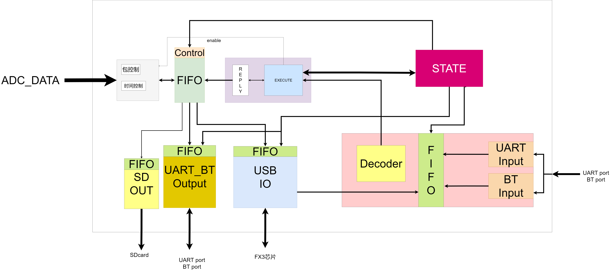
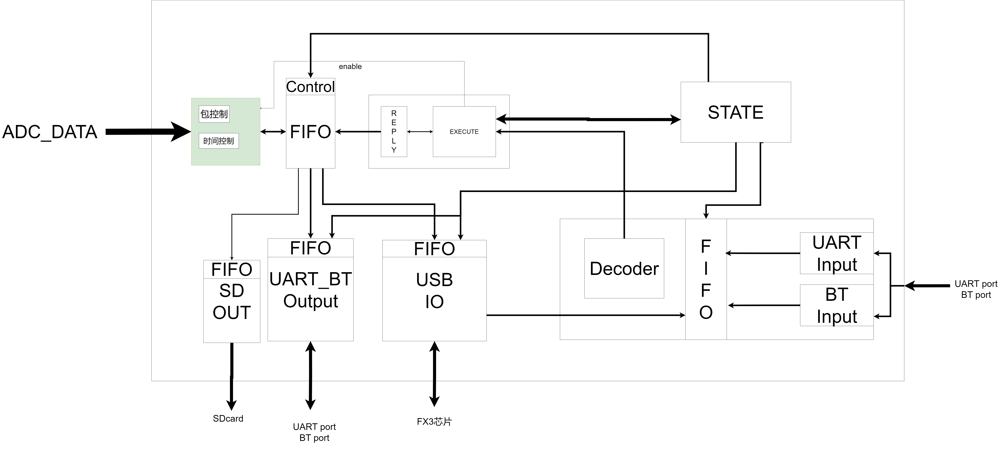
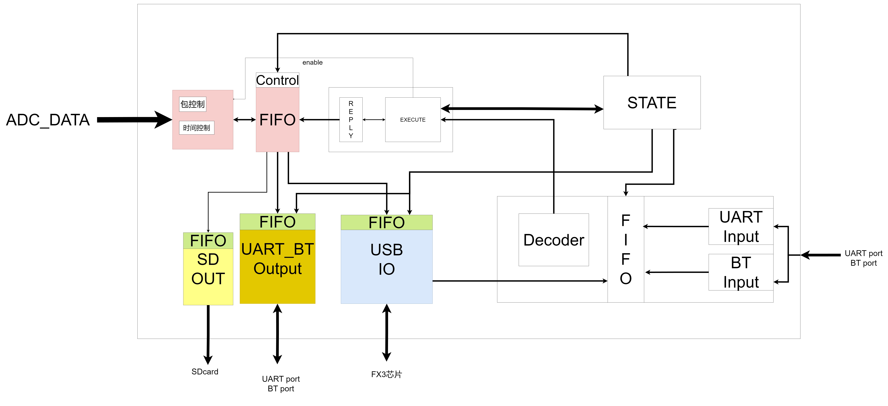
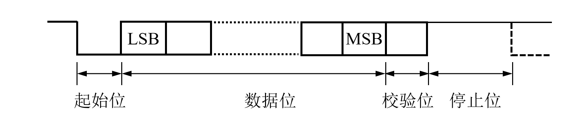
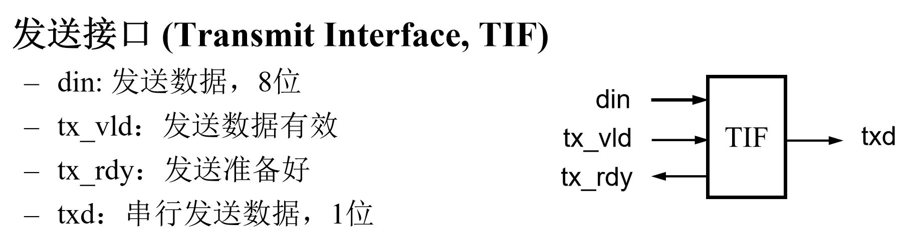
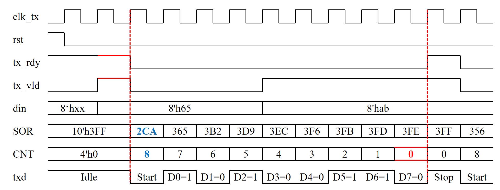
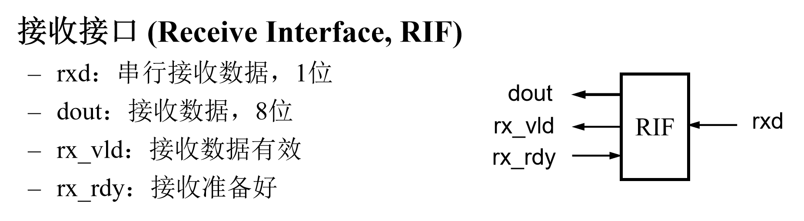
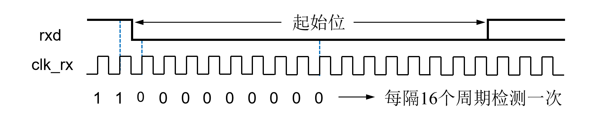
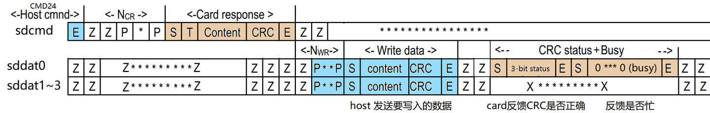

# 大研实验文档

## 总体架构

图示：实际架构图如下：



下文就是对各个模块的详细介绍。

目录：
1. 数据生成部分
2. 数据传输通道


## 数据生成部分

### 叙述

无论通过任何通道去向外界传输信息，都会共同从 `TOP` 模块的 `in8_out8_fifo` 中去取得自己模块的数据，然后放入自己模块的独立`FIFO`中。

进而， `in8_out8_fifo` 的数据来自于 `matric_ctrl_v1` 模块的输出。

 `matric_ctrl_v1` 模块从外界的ADC模块接收**离散**的数字信号，在模块中打包成一个标准的包结构。

本章节仅涉及数据的生成，不设计数据的控制和写使能相关内容。

图示如下：





### 数据帧的格式

| 字段名称        | 数据类型 | 长度 (字节)  | 描述                                                         |
| :-------------- | :------- | :----------- | :----------------------------------------------------------- |
| SEND_HEAD4      | 头部     | 4            | 数据帧的固定头部标识符。                                     |
| SEND_ALL_LEN3   | 长度     | 3            | 数据帧的总长度（除自身外），占用3字节。                      |
| SEND_SERIALNUM1 | 序列号   | 1            | 数据帧的唯一序列号，占用1字节。                              |
| SEND_DATA_LEN4  | 数据长度 | 4            | 包含矩阵数据的行数和列数信息，共4字节。                      |
| send_pkt_num4   | 包号     | 4            | 当前数据包在序列中的编号，占用4字节。                        |
| send_time4      | 时间戳   | 4            | 数据发送或采集的时间信息，占用4字节。                        |
| send_accuracy   | 精度     | 1            | 数据采集或处理的精度信息，占用1字节。                        |
| reserved        | 保留     | 4            | 保留字段，为未来扩展预留，占用4字节。                        |
| matrix_data     | 矩阵数据 | 24 * ADC_NUM | 实际的矩阵数据，大小取决于ADC_NUM的值，每个ADC对应24字节的数据。 |
| send_sum_check  | 校验和   | 1            | 数据帧的校验和，用于验证数据完整性，占用1字节。              |

模块最后输出的数据帧的格式如上表所示。

但是，为了增加灵活变化的能力，使用一个`bitmask` 去选择性屏蔽不需要传输的部分

上层例化模块实际传递参数：`BITMASK = 10'b11_0111_1111`，选择不传递 `SEND_SERIALNUM1  ` 参数

所以实际上，总计目前的一个数据栈的大小是 `86425 Bytes` 


### 代码架构详解

#### 变量解释

```verilog
    #(
        parameter ADC_NUM           = 15,
        parameter SERIAL_NUM        = 1,
        parameter ACCURACY          = 1,
        parameter N_ROW             = 240,
        parameter N_COL             = 120,  // ensured that N_COL is 8 * ADC_NUM 每个ADC由8个点位，每个点位的大小是3字节
        parameter CLK_FRE           = 50, //MHz
        parameter DATA_RATE         = 100, //Hz
        parameter BITMASK           = 10'b11_1111_1111
    )(
        input       clk,
        input       rst_n,
        // ADC Data
        input [192 * ADC_NUM - 1 : 0]               i_adc_data,
        // send data to fifo
        output reg [7:0]                            o_data_to_fifo,
        // Flag
        input                                       i_returnFrame_begin, // 表示返回帧准备好了，停止发送数据
        output logic                                o_returnFrame_begin, // 表示返回帧可以开始发送数据
        input                                       i_start_matrix,
        output reg                                  o_start_row,
        input                                       i_adc_data_valid,
        output reg                                  o_switch_row,
        input                                       i_fifo_full,
        output                                      o_fifo_wr_en

        ,output logic [12: 0] state
    );
```

1. `SERIAL_NUM` 是希望指定本块板的序列号，用于之后多个板同时产生数据帧用于区分功能

2. `ACCURACY` 是用于区分本数据帧是来自于 `FPGA` 和 `STM32` 的体现

   `  // 区分是FPGA还是STM32的数据  assign send_accuracy   = (ACCURACY == 1) ? 8'h96 : 8'h69;`

   在实际的帧包中，会指定某个区域的内容

3. `CLK_FRE` 是指定本模块的时钟频率的，用于在等待时的计数器切分作用

4. `DATA_RATE` 是指定在发送数据帧时，采集的频率——实际上默认了等待的时间

5. `BITMASK` 是指定了需要发送的帧的数据段

6. 与实际数据发送相关：

   每个帧中，会传输 `N_ROW` 行数据，每次数据的来源都是`i_adc_data`

   1. `ADC_NUM` ：一行的数据，由多个ADC模块采集而来，命名为`ADC_NUM`。每个ADC有3个点位，每个点位会一次性传输`8Bytes`的数据(即一个ADC一次传输24Bytes)。
   2. `N_ROW`：传递的行数
   3. `N_COL`：等价于`ADC_NUM * 8(点位)`
7. `i_adc_data`：来自于ADC模块的采集数据，大小为`192 * ADC_NUM`，即每行的ADC采集的数据量。
   `i_adc_data_valid`：表示ADC数据有效的标志位，当为1时，表示可以开始传输当前行的数据。
8. `o_data_to_fifo`：输出到`in8_out8_fifo`的实际数据，大小为8位。
   `o_fifo_wr_en`：表示是否允许向`in8_out8_fifo`写入数据的标志位，当为1时，表示可以写入数据。

9. `i_returnFrame_begin`：表示是否有返回帧需要传递的标志位，当为1时，表示当前有返回帧等待传递。
   `o_returnFrame_begin`：表示可以开始发送返回帧的标志位，当为1时，表示可以开始发送返回帧数据。

#### 大体核心

```verilog
    // 状态机的状态
    localparam                          S_IDLE              = 13'b0_0000_0000_0001;
    localparam                          S_SEND_HEAD         = 13'b0_0000_0000_0010;
    localparam                          S_SEND_ALL_LEN      = 13'b0_0000_0000_0100;
    localparam                          S_SEND_SERAILNUM    = 13'b0_0000_0000_1000;
    localparam                          S_SEND_DATA_LEN     = 13'b0_0000_0001_0000;
    localparam                          S_SEND_PKT_NUM      = 13'b0_0000_0010_0000;
    localparam                          S_SEND_TIME         = 13'b0_0000_0100_0000;
    localparam                          S_SEND_ACCURACY     = 13'b0_0000_1000_0000;
    localparam                          S_SEND_RESERVED     = 13'b0_0001_0000_0000;
    localparam                          S_SET_ROW           = 13'b0_0010_0000_0000;
    localparam                          S_WAIT_DATA         = 13'b0_0100_0000_0000;
    localparam                          S_SEND_ROW          = 13'b0_1000_0000_0000;
    localparam                          S_SEND_SUM_CHECK    = 13'b1_0000_0000_0000;
always@(*)
    begin
        case(state)
            S_IDLE:
            // 什么情况开始进行数据帧传递
            // 1. i_returnFrame_begin表明没有返回帧需要传递
            // 2. i_start_matrix表明开始传递数据帧
            // 3. i_fifo_full表明FIFO没有满，这里并不是IDLE特有的
                if (i_start_matrix == 1'b1 && ~i_fifo_full && ~i_returnFrame_begin)
                    next_state = S_SEND_HEAD;
                else
                    next_state = S_IDLE;
            S_SEND_HEAD:
                if (r_shift_cnt == LEN_send_head && ~i_fifo_full || ~head_send)
                    next_state = S_SEND_ALL_LEN;
                else
                    next_state = S_SEND_HEAD;
            S_SEND_ALL_LEN:
                if (r_shift_cnt == LEN_send_all_len && ~i_fifo_full || ~all_len_send)
                    next_state = S_SEND_SERAILNUM;
                else 
                    next_state = S_SEND_ALL_LEN;
            S_SEND_SERAILNUM:
                if (r_shift_cnt == LEN_send_serialNum && ~i_fifo_full || ~serialNum_send)
                    next_state = S_SEND_DATA_LEN;
                else
                    next_state = S_SEND_SERAILNUM;
            S_SEND_DATA_LEN:
                if (r_shift_cnt == LEN_send_data_len && ~i_fifo_full || ~data_len_send)
                    next_state = S_SEND_PKT_NUM;
                else
                    next_state = S_SEND_DATA_LEN;
            S_SEND_PKT_NUM:
                if (r_shift_cnt == LEN_send_pkt_num && ~i_fifo_full || ~pkt_num_send)
                    next_state = S_SEND_TIME;
                else
                    next_state = S_SEND_PKT_NUM;
            S_SEND_TIME:
                if (r_shift_cnt == LEN_send_time && ~i_fifo_full || ~time_send)
                    next_state = S_SEND_ACCURACY;
                else
                    next_state = S_SEND_TIME;
            S_SEND_ACCURACY:
                if (r_shift_cnt == LEN_send_accuracy && ~i_fifo_full || ~accuracy_send)
                    next_state = S_SEND_RESERVED;
                else
                    next_state = S_SEND_ACCURACY;
            S_SEND_RESERVED:
                if (r_shift_cnt == LEN_send_reserved && ~i_fifo_full || ~reserved_send)
                    next_state = S_SET_ROW;
                else
                    next_state = S_SEND_RESERVED;
            S_SET_ROW:
                if(~row_data_send)
                    next_state = S_SEND_SUM_CHECK;
                else if (r_clk_cnt == WAIT_TIME_row)
                    next_state = S_WAIT_DATA;
                else
                    next_state = S_SET_ROW;
            S_WAIT_DATA:
                if (i_adc_data_valid == 1'b1 && ~i_fifo_full)
                    next_state = S_SEND_ROW;
                else
                    next_state = S_WAIT_DATA;
            S_SEND_ROW:
                if (r_shift_cnt == LEN_row_data && ~i_fifo_full)
                    if (r_row_cnt < N_ROW)
                        next_state = S_SET_ROW;
                    else
                        next_state = S_SEND_SUM_CHECK;
                else
                    next_state = S_SEND_ROW;
            S_SEND_SUM_CHECK:
                if (r_shift_cnt == LEN_send_sum_check && ~i_fifo_full || ~sum_check_send)
                    // next_state = S_SEND_HEAD;
                    next_state = S_IDLE;
                else
                    next_state = S_SEND_SUM_CHECK;
            default:
                next_state = S_IDLE;
        endcase
    end
```

在获得`开始信号`并且检索到`写允许`的情况下，这个状态机一定会完整执行完整个数据帧发送流程，无法被中止。

> 会向 in8_out8_fifo传递数据的模块还有一个，二者是竞争资源的状态。
>
> 所以这里为了保证帧的完整性，必然会由无法中止的限制

+ 每个状态大部分都是相同的

  + 模块开始：上一个模块完成后，自动进入

  + 模块结束：

    case1

    + 该部分发送结束：使用一个计数器维护已经发送的数据长度，在长度计数器等于需要发送的总长度时，视为模块结束条件1完成。
    + `FIFO` 允许写

    case2

    + 该部分被屏蔽，直接结束( `||` 符号实现 )

  + 结束去处：

    + 大部分：进入下一个数据帧指定的位置
    + 不同：输送 `DATA` 值时，需要**循环传送** `N_ROL` 行，每行传递完成后，需检查已传递行数作为检查。


#### 变量的确定

1. 先确定数据帧每个项的长度：查看`LEN_send_xxx`变量

   ```verilog
       // 为提前确定数据帧长度而设置的参数，单位 字节
       localparam  LEN_send_head           = 4;  // 32
       localparam  LEN_send_all_len        = 3;  // 24
       localparam  LEN_send_serialNum      = 1;  // 8
       localparam  LEN_send_data_len       = 4;  // 32,Made up of rows and columns
       localparam  LEN_send_pkt_num        = 4;  // 32
       localparam  LEN_send_time           = 4;  // 32
       localparam  LEN_send_accuracy       = 1;  // 8
       localparam  LEN_send_reserved       = 4;  // 32
       localparam  LEN_row_data            = 24 * ADC_NUM;  // 192 * ADC_NUM
       localparam  LEN_send_sum_check      = 1;  // 8
   ```

2. 之后根据长度，声明对应的变量

   ```verilog
       // 将数据帧的各个部分拆分开，其中的位宽由上面的长度参数决定
       wire [8 * LEN_send_head - 1: 0]         send_head;
       wire [8 * LEN_send_all_len - 1: 0]      send_all_len;
       wire [8 * LEN_send_serialNum - 1: 0]    send_serialNum;
       wire [8 * LEN_send_data_len - 1: 0]     send_data_len;
       wire [8 * LEN_send_pkt_num - 1: 0]      send_pkt_num;
       wire [8 * LEN_send_time - 1: 0]         send_time;
       wire [8 * LEN_send_accuracy - 1: 0]     send_accuracy;
       wire [8 * LEN_send_reserved - 1: 0]     send_reserved;
       wire [8 * LEN_row_data - 1: 0]          send_row_data;
       reg  [8 * LEN_send_sum_check - 1: 0]    send_sum_check;
   ```

   这里声明后，如果是固定的，就直接给出具体的值，如`head, datalen, accuracy, reserved`等

   否则，需要计算或者获取，如`all_len, pkt_num, time`等

   注：

   + `pkt_num` 的值通过模块 `cal_pkt_num`直接获得，例化模块调用即可
   + `time` 类似，通过`cal_time`
   + `len`计算见后分析

3. 根据宏参 `BITMASK` ，确定实际发送对象

   ```verilog
       // 一位的控制信号，用于判断数据帧的各个部分是否需要发送
       // 由宏参数BITMASK决定，每一位对应一个部分
       wire [ 0: 0] head_send;
       wire [ 0: 0] all_len_send;
       wire [ 0: 0] serialNum_send;
       wire [ 0: 0] data_len_send;
       wire [ 0: 0] pkt_num_send;
       wire [ 0: 0] time_send;
       wire [ 0: 0] accuracy_send;
       wire [ 0: 0] reserved_send;
       wire [ 0: 0] row_data_send;
       wire [ 0: 0] sum_check_send;
   
       assign head_send        = | (BITMASK & 10'b10_0000_0000);
       assign all_len_send     = | (BITMASK & 10'b01_0000_0000);
       assign serialNum_send   = | (BITMASK & 10'b00_1000_0000);
       assign data_len_send    = | (BITMASK & 10'b00_0100_0000);
       assign pkt_num_send     = | (BITMASK & 10'b00_0010_0000);
       assign time_send        = | (BITMASK & 10'b00_0001_0000);
       assign accuracy_send    = | (BITMASK & 10'b00_0000_1000);
       assign reserved_send    = | (BITMASK & 10'b00_0000_0100);
       assign row_data_send    = | (BITMASK & 10'b00_0000_0010);
       assign sum_check_send   = | (BITMASK & 10'b00_0000_0001);
   ```

   实现方法是，只观察真正要传输的那位，使用 `&` 操作实现，然后自或操作将其检出

4. 计算`len`

   ```verilog
       // 计算数据帧的总长度
       wire [31: 0] len_1  = LEN_send_head & {32{head_send}}           ;
       wire [31: 0] len_2  = LEN_send_serialNum & {32{serialNum_send}} ;
       wire [31: 0] len_3  = LEN_send_pkt_num & {32{pkt_num_send}}     ;
       wire [31: 0] len_4  = LEN_send_accuracy & {32{accuracy_send}}   ;
       wire [31: 0] len_5  = LEN_send_sum_check & {32{sum_check_send}} ;
       wire [31: 0] len_6  = LEN_send_all_len & {32{all_len_send}}     ;
       wire [31: 0] len_7  = LEN_send_data_len  & {32{data_len_send}}  ;
       wire [31: 0] len_8  = LEN_send_time & {32{time_send}}           ;
       wire [31: 0] len_9  = LEN_send_reserved  & {32{reserved_send}}  ;
       wire [31: 0] len_a  = (LEN_row_data & {32{row_data_send}}) * N_ROW ; // = 3*N_ROW*N_COL = 3*N_ROW*8*ADC_NUM = 24 * N_ROW * ADC_NUM
       assign send_all_len = len_1 + len_2 + len_3 + len_4 + len_5 + len_6 + len_7 + len_8 + len_9 + len_a;
   ```

   获得实际的长度——传递则是真实长度，否则为0

   然后相加获得 `send_all_len`量

### 总结

到现在为止，随着 `TOP` 模块不断给出数据和数据是能信号，本模块在 `FIFO` 未满的情况下，可以不断的产生1字节的数据给 `TOP` 模块的FIFO


## 数据传输通道

### 前言

总共实现了4种数据传输通道，目前能够正确运行并且经过测试的有：`uart, blueTooth, USB`， 还需要调试的有`SD card`

其中`uart, blueTooth, USB`都是涉及到`Input 和 output`的，除了正常的传输数据，还支持接收上位机的命令帧，然后对机器状态做修改

图示如下：



本段不涉及`FIFO`的填充方式。默认，自己部分的`FIFO`会被**正确**填充，只需要关注从 `FIFO` 中请求到需要的数据，然后按照标准发送出去即可。`FIFO`的填充方式见下文的单独讲解。

下面逐个讲解每个通道的实现原理


### Uart和BlueTooth

#### 前言

之所以把二者放在一起，这是应为都是通过串口通讯这样的双工方式，通过2根线进行通讯。其性能和实现方式非常相似。

对于`uart` ，通过杜邦线连接到TTL模块上，TTL模块通过串口连接到上位机。

对于`blueTooth`，通过杜邦线连接到蓝牙模块，然后由蓝牙模块连接到上位机。

串口转TTL和蓝牙模块的具体实现，由购买的设备自行实施，具体的协议等需要查看相关文档。

#### 实现和原理

由上文分析可得，二者的实现逻辑代码**完全一致**。下文统一用`串口`代表上文的`UART BT`

串口分为串口发送和接收

串口是最简单的通讯方式之一，我们通过将一个字节的数据逐个位顺序发送，从而实现对于数据的传输。只要通讯双方都能“理解”彼此的数据格式，就可以实现通讯。

那么，串口是如何约定数据格式的呢？我们这里介绍本实验中要求实现的最简单的协议：

对于发送方，面向接收方的这个单比特数据通道在空闲时应当保持为1，这样接收方就知道此刻不是有效数据了。当需要发送数据时，这个通道里的数据会被突然置为0，并保持一个周期——这个周期在接收方看来，就是“全体目光向我看齐，我宣布个事”，这一位数据也被称为**起始位**。从下一个周期开始，发送方会把要传输的8bit数据**从低位到高位**依次发送到数据通道里，这个过程会持续8个周期（因为是8位）。

传输之后，串口不能立刻传输下一个数据，而是要强行把数据通道置为1，用来告知发送方“我说完了，你可以走了”。这个过程也会持续一个周期。



在这个过程中，发送方和接收方约定了以下几件事：

1. 起始位保持1个周期
2. 传输8bit数据
3. 结束位保持1个周期
4. 传输速率都是每秒9600个bit

只要双方都按照这个规则来发送、接收、拼接数据，就可以得到一个完整的8bit数据。


#### **3.2 串行通信发送接口**



发送接口左侧是面向需要发送数据的模块的，右侧是面向FPGA开发板上的串行通讯外设的。我们需要实现的功能是：

* 当需要发送数据的模块将tx_vld置为1时，TIF会从din中接收到需要发送的数据，并将其拼接好起始位和停止位，写入内部的移位寄存器中
* 移位寄存器每个周期会将最低位的数据发送到txd上，并右移一个bit
* 当移位寄存器把所有位全部发送完毕后，tx_rdy会被置为1，表示发送完毕，外部模块就可以向TIF发送下一个待发送数据了

**发送时序**

* tx_vld和tx_rdy均有效时，数据din前后附加启动和停止位后存入SOR，tx_rdy清零，移位计数器CNT加载常数8
* 随后SOR通过右移实现串行输出，同时CNT递减
* CNT等于0时，停止移位和计数，tx_rdy置1




#### **3.3 串行通信接收接口**



接收模块的总体逻辑和发送模块是比较类似的，但接受的逻辑更加复杂一点点，涉及到一个重要的概念——**采样**。

!!! info "何谓“采样”"

    对于任何一个通信模块而言，我们都不能期望在确定的时钟周期中检测到确定的值。我们通常会用一个速度较快的时钟，对接收到的信号做检测。由于发送接收的模块的时钟是较慢的，而接收模块的时钟较快，所以我们肯定能检测到被发送的信号。同样地，为了避免发送通道中的“杂音”，接收模块需要“确认”收到了正确的数据，这个过程就可以通过**稳定检测到信号持续n个周期**来实现。

**接收时序**

* 当检测到rxd信号由1到0跳变，且8个接收时钟(clk_rx)后检测仍为0，则确认为起始位
* 接着每隔16个接收时钟，对rxd检测一次，依次作为数据位、校验位和停止位，存入SIR
* 若未发生停止位或奇偶校验位出错，则将SIR中数据位存入输入缓冲寄存器(Input Buffer Register, IBR)，并设置rx_vld有效



只要连续16个周期信号都是稳定的，那么我们就可以认为接收到了1bit数据。我们再通过一个移位器将其拼接好，当所有的数据都返回后，将rxd_valid置为1，表示接收完毕。

对于串口的设计和实现，可以查看文档`UART.pdf`进一步学习，这里不再展开赘述。

#### 数据内容

模块中，串口发送模块传输`UART_BT_FIFO`中的数据。数据来源于 `TOP` 模块的 `in8_out8_fifo`。但是在传入`UART_BT_FIFO`之后，需要进行一次通路判断，下文会提及。

串口接收模块接收来自上位机的命令数据，命令数据的格式和内容由上位机发送端决定。接收到的数据会被放入一个 `FIFO`，这个 `FIFO` 接收`UART, BT, USB` 三者的接收数据。

### USB3.0

<span id="USB"></span>

USB模块负责将数据通过USB接口进行传输。数据来源同样是`TOP`模块的`in8_out8_fifo`。

#### 1. 端口和变量意义

##### 1.1 FX3 Slave FIFO接口信号

- **时钟与复位**:
  - `clk`: 100MHz系统时钟
  - `rst_n`: 低电平有效复位信号
- **FX3标志信号**:
  - `fx3_flaga`: 地址00时，Slave FIFO写入满标志位(可写)
  - `fx3_flagb`: 地址00时，Slave FIFO写入快满标志位(拉低后还可写入6Byte)
  - `fx3_flagc`: 地址11时，Slave FIFO读空标志位(可读)
  - `fx3_flagd`: 地址11时，Slave FIFO读快空标志位(拉低后还可读取6Byte)
- **FX3控制信号**:
  - `fx3_slcs_n`: Slave FIFO片选信号，低电平有效
  - `fx3_slwr_n`: Slave FIFO写使能信号，低电平有效
  - `fx3_slrd_n`: Slave FIFO读使能信号，低电平有效
  - `fx3_sloe_n`: Slave FIFO输出使能信号，低电平有效
  - `fx3_pktend_n`: 包结束信号
  - `fx3_a[1:0]`: 操作FIFO地址(00-写，11-读)
  - `fx3_db[31:0]`: 32位双向数据总线

##### 1.2 数据流控制信号

- **发送方向**:
  - `i_data_from_fifo`: 从FPGA FIFO读取的数据
  - `i_fifo_empty`: FIFO空标志
  - `i_fifo_prog_empty`: FIFO接近空标志(阈值256)
  - `o_fifo_rd_en`: FIFO读使能信号
- **接收方向**:
  - `i_fifo_rd_ready`: 接收FIFO准备好标志
  - `o_data_from_fifo`: 输出到FPGA FIFO的数据
  - `o_data_valid`: 数据有效标志
  - `o_waiting_false`: 等待结束标志

##### 1.3 内部重要变量

- `num`: 数据计数器(记录当前传输的数据量)
- `delaycnt`: 延时计数器
- `fxstate`: 状态机当前状态
- `r_data_from_fifo`: 写数据寄存器
- `fx3_rdb`: FX3读出数据缓存
- `fx3_rdb_en`: 读出数据有效标志


#### 2. 主要和关键逻辑

##### 2.1 状态机设计

该模块采用一个7状态的状态机控制USB数据传输流程：

1. **FXS_REST**: 复位状态
2. **FXS_IDLE**: 空闲状态，等待操作条件满足
3. **FXS_READ**: 从USB FIFO读取数据
4. **FXS_RDLY**: 读取flagd拉低后的6个数据
5. **FXS_RSOP**: 读取操作结束
6. **FXS_WRIT**: 向USB FIFO写入数据
7. **FXS_WSOP**: 写入操作结束

##### 2.2 数据传输控制

###### 读操作流程(FXS_READ→FXS_RDLY→FXS_RSOP):

1. 检查`fx3_flagc`(可读)和`i_fifo_rd_ready`(接收FIFO准备好)
2. 设置FX3控制信号为读模式(`fx3_a=2'b11`)
3. 读取数据并存入`fx3_rdb`
4. 当`fx3_flagd`变低后，继续读取6个数据
5. 结束读操作

###### 写操作流程(FXS_WRIT→FXS_WSOP):

1. 检查`fx3_flaga`(可写)和`~i_fifo_prog_empty`(发送FIFO非空)
2. 设置FX3控制信号为写模式(`fx3_a=2'b00`)
3. 从FIFO读取数据(`o_fifo_rd_en`置高)
4. 写入指定数量数据(`WRITE_NUM`参数控制)
5. 发送包结束信号(`fx3_pktend_n`置低)
6. 结束写操作

##### 2.3 数据方向控制

通过`fx3_dir`信号控制双向数据总线方向:

- 写操作时(`fx3_dir=0`): FPGA驱动`fx3_db`总线
- 读操作时(`fx3_dir=1`): FX3驱动`fx3_db`总线

#### 3. 状态机详细说明

##### 3.1 状态转移条件

状态转移主要由以下条件触发:

1. **IDLE→READ**:
   - `i_fifo_rd_ready && fx3_flagc` (接收FIFO准备好且USB FIFO可读)
2. **IDLE→WRIT**:
   - `fx3_flaga && ~i_fifo_prog_empty` (USB FIFO可写且发送FIFO非空)
   - 可以从代码的`if-else`逻辑发现，这里默认USB读优先，因为上位机传递命令的概率极小，而且对系统状态的控制有显著意义，所以选择读优先
3. **READ→RDLY**:
   - `!fx3_flagd` (USB FIFO快空标志变低)
4. **RDLY→RSOP**:
   - `delaycnt >= 4'd6` (完成6个额外数据的读取)
5. **WRIT→WSOP**:
   - `num >= WRITE_NUM + 1` (完成指定数量数据的写入)
6. **WSOP→IDLE**:
   - `delaycnt >= 4'd4` (完成写操作结束延时)

##### 3.2 状态机输出

每个状态下FX3控制信号的设置:

- **IDLE**: 所有控制信号无效
- **READ**:
  - `fx3_slcs_n=0` (片选有效)
  - `fx3_slrd_n=0` (读使能)
  - `fx3_sloe_n=0` (输出使能)
  - `fx3_a=2'b11` (读地址)
- **RDLY**:
  - 在`delaycnt==2`时释放读使能
  - 在`delaycnt==6`时释放所有控制
- **WRIT**:
  - `num==1`时:
    - `fx3_slcs_n=0` (片选有效)
    - `fx3_slwr_n=0` (写使能)
    - `fx3_a=2'b00` (写地址)
  - `num==WRITE_NUM`时:
    - `fx3_pktend_n=0` (包结束)
  - `num==WRITE_NUM+1`时:
    - 释放所有控制

##### 3.3 特殊处理逻辑

1. **等待结束检测(`o_waiting_false`)**:
   - 当从WRIT状态回到IDLE状态时触发
   - 或者在IDLE状态等待超时(计数器归零)时触发
   - 这个信号是接收信息时，判定结束的标准，`USB, uart, BT`各有一个对应的信号。
   
     代码中，默认输入的长度是不固定的，结束标志位固定时间内没有新的输入为中止标准，即这里的`waiting_false`
2. **数据有效性处理**:
   
   - 读数据在`FXS_READ`状态(num≥3)和`FXS_RDLY`状态(delaycnt<5)时有效
   - 通过`fx3_rdb_en`标志数据有效性
3. **FIFO读控制**:
   - 仅在`FXS_WRIT`状态下且满足条件时产生`o_fifo_rd_en`
   - 条件: `num < WRITE_NUM && fx3_flaga && ~i_fifo_empty`

#### 总结

该设计实现了FPGA通过USB3.0控制器(CYPRESS FX3)的Slave FIFO接口进行高速数据通信的功能。关键点包括:

1. 采用状态机精确控制USB FIFO的读写时序
2. 双向数据总线的方向控制
3. 与FPGA内部FIFO的协同工作
4. 完善的流控制机制(通过flag信号)
5. 可配置的传输数据量(通过WRITE_NUM参数)

这种设计适用于需要高速数据采集或传输的应用场景，如图像采集、高速数据记录等。


### SD Card

SD卡模块负责将数据通过SD卡进行存储。数据来源同样是`TOP`模块的`in8_out8_fifo`。

代码模块结构为：

```
- SD_part_TOP
-- SD_FIFO
-- sdcard_writer
--- sdcmd_ctrl
--- sddata_ctrl
```

显然，核心逻辑上，在 `SD_part_TOP` 模块中，`SD_FIFO`模块负责将数据从`TOP`模块的`in8_out8_fifo`传递到`sdcard_writer`模块中。

而`sdcard_writer`模块则负责将数据写入到SD卡中。

具体而言，是要按照SD卡的协议实现，下面给出作者在实现时，借鉴的代码和参考的最重要的文档。

文档：[点击](https://zhuanlan.zhihu.com/p/610495260)

文档中，提及的实现好的有文件系统的`SDcard read`模块：[点击](https://github.com/WangXuan95/FPGA-SDcard-Reader)

同样，本段也假设`SD_FIFO`模块已经正确填充了数据，且`sdcard_writer`模块可以正确读取到数据。只涉及`sdcard_writer`模块的实现细节。

本模块实现了FPGA通过SPI模式对SD卡进行初始化和数据写入的功能。下面将结合SD协议详细讲解实现原理。

#### 1. SD_part_TOP模块

##### 1.1 SD卡接口信号

- **sdclk**: 时钟信号，由FPGA提供给SD卡
- **sdcmd**: 命令/响应信号，双向
- **sddat0**: 数据线，本设计仅使用DAT0进行单线数据传输

##### 1.2 SD卡操作模式

SD卡支持两种通信模式：

1. **SD模式**: 使用4条数据线并行传输
2. **SPI模式**: 使用单条数据线串行传输

本设计采用SDIO模式，为高速传输提供支持。但是目前只实现了单线传输。未来可以拓展到4线传输。

#### 2. SD卡初始化流程

SD卡初始化是写操作的前提，主要流程如下：

##### 2.1 状态机设计

模块使用状态机(`sdcmd_stat`)控制全部流程：

```verilog
localparam [3:0] 
    CMD0      = 4'd0,   // 复位SD卡
    CMD8      = 4'd1,   // 发送接口条件
    CMD55_41  = 4'd2,   // 发送APP_CMD(CMD55)
    ACMD41    = 4'd3,   // 发送SD_SEND_OP_COND(ACMD41)
    CMD2      = 4'd4,   // 获取CID
    CMD3      = 4'd5,   // 获取相对地址(RCA)
    CMD7      = 4'd6,   // 选择卡
    CMD16     = 4'd7,   // 设置块长度
    CMD24     = 4'd8,   // 写单个块
    WRITING   = 4'd9,   // 准备写入数据
    WRITING2  = 4'd10;  // 正在写入数据
```

其中，CMD24之前都算是初始化流程，在系统自启动或者`rstn`信号之后，自动尝试重新连接SD卡

CMD24和WRITING，WRITING2是实际写操作，但是写的更加详细的状态机，实际上是在`sddata_ctrl`中实现的。

##### 2.2 信号详解

具体的每个指令的格式和详细意义以及返回值，请参考上方提到的文档，或者在网上插值SDIO通讯协议的相关标准文档。
虽然SDIO卡在初始化阶段使用与标准SD卡非常相似的命令集，但它们属于SD卡规范的一部分。以下解释这些命令在SDIO卡初始化和写操作中的作用：

1. CMD0 (GO_IDLE_STATE):
    + 含义: 请求卡进入空闲状态。
    + 作用: 这是初始化流程的第一步，用于复位卡，使其忽略后续命令直到收到有效的CMD1或CMD8。对于SDIO卡，这同样有效，确保卡处于已知初始状态。
2. CMD8 (SEND_IF_COND):
+ 含义: 请求卡发送其接口条件，特别是支持的电压范围和接口版本。
+ 作用: 用于检测卡是否是SD 2.0或更高版本。响应参数中的'haa是主机期望的值，卡的响应应包含此值以表明兼容性。这对于区分SDv1和SDv2/SDHC卡至关+ 重要。
3. CMD55 (APP_CMD):
  + 含义: 应用特定命令前导。它不是一个独立的命令，而是用来请求卡为下一个命令（ACMD）返回应用特定的响应。
  + 作用: 必须成对使用，先发送CMD55，然后发送目标ACMD（如CMD41）。参数通常为0（选择无RCA的卡）或卡的RCA（选择特定卡）。在初始化中，用于发送+ ACMD41。
4. ACMD41 (SD_SEND_OP_COND):
  + 含义: SD卡发送操作条件。这是一个应用特定命令（需要先发CMD55）。
  + 作用: 这是初始化SD 2.0及更高版本卡的关键命令。主机通过发送ACMD41（通常包含主机能力信息）来轮询卡，直到卡准备好并返回一个表示就绪的响应+ （最高位为1）。这个过程可能需要多次尝试。
5. CMD2 (ALL_SEND_CID):
  + 含义: 请求所有卡发送其CID寄存器内容。
  + 作用: CID包含卡的唯一标识信息（制造商ID、产品名、序列号、生产日期等）。在多卡系统中用于识别特定卡，但在单卡系统中主要用于获取卡的详细信息。
6. CMD3 (SET_RELATIVE_ADDR):
  + 含义: 设置相对卡地址。
  + 作用: 为卡分配一个16位的相对地址(RCA)。在多卡系统中，主机使用RCA来选择特定卡（通过CMD7）。在单卡系统中，RCA通常设为'h0001，并在后续命令（如CMD7）中使用。
7. CMD7 (SELECT_CARD / DESSELECT_CARD):
  + 含义: 选择/取消选择卡。
  + 作用: 使用卡的RCA选择特定卡进行数据传输。被选中的卡会从高阻态变为活动状态，准备接收/发送数据。取消选择会使卡回到高阻态。
8. CMD16 (SET_BLOCKLEN):
  + 含义: 设置块长度。
  + 作用: 设置后续读/写操作中使用的块大小（以字节为单位）。对于大多数标准SD卡操作，块大小设置为512字节。这个设置在每次传输前可能需要重新确认。
9. CMD24 (WRITE_SINGLE_BLOCK):
  + 含义: 写入单个块。
  + 作用: 这是写入操作的核心命令。它指定要写入的块地址（对于SDHC/SDXC卡是逻辑块地址LBA，对于标准容量卡是物理块地址，需要乘以512），然后主机需要发送512字节的块数据。响应是数据响应令牌，指示写入是否成功开始。
与SPI模式的区别:

命令格式: 在SPI模式下，所有命令都通过单线MISO发送，并且命令格式略有不同（通常在命令索引前添加一个起始字节0x40，响应格式也不同）。这段代码显然是为多线SDIO/SD总线设计的，直接发送命令索引。

+ RCA的使用: 在SPI模式下，通常不需要RCA，因为主机直接与唯一的卡通信。这段代码明确使用了RCA（CMD3, CMD7），是SDIO/SD总线多卡环境或标准流程的特征。
+ ACMD: SPI模式下通常不支持ACMD，或者需要特殊处理。这段代码明确使用了CMD55和ACMD41，这是SDIO/SD总线规范的一部分。
+ 数据传输: SPI模式使用单线串行数据传输，而SDIO模式使用多线并行（通常是4线）数据传输，速度更快。代码中data_start和d_done等信号暗示了并行数据控制逻辑。

#### 3. SD卡写操作实现

##### 3.1 写操作流程

1. 实际在`sddata_ctrl`中实现相关 `data` 总线的操作
2. `CMD24` 的发送是在`sdcmd_ctrl`模块中实现的，但是与上面的初始化稍有不同，只在信号 `data_start`  相关（即怎么衡定SD回复结束）有所区别。

##### 3.2 关键代码分析

```verilog
always @ (posedge clk or negedge rstn)
    if(~rstn) begin
        set_cmd(0,0,0,0);
        clkdiv      <= SLOWCLKDIV;
        wsectoraddr <= 0;
        rca         <= 0;
        sdv1_maybe  <= 1'b0;
        card_type   <= UNKNOWN;
        sdcmd_stat  <= CMD0;
        // sdcmd_stat  <= CMD24;
        cmd8_cnt    <= 0;
    end else begin
        set_cmd(0,0,0,0);
        if(sdcmd_stat == WRITING2) begin
            // 先收回上一个时钟周期的d_start信号
            d_start <= 1'b0;
            // TODO: 为了快速传输数据，对位写入的数据确实不管理。
            if( d_done ) begin
                // sddata_ctrl模块已经完成数据的写入
                // FIXME: 无论是成功还是失败，sddata_ctrl模块都给了一个d_done信号，进入CMD24状态
                sdcmd_stat <= CMD24;
            end
        end 
        else if(~busy) begin
            case(sdcmd_stat)
                CMD0    :   set_cmd(1, (SIMULATE?512:64000),  0,  'h00000000);
                CMD8    :   set_cmd(1,                 512 ,  8,  'h000001aa);
                CMD55_41:   set_cmd(1,                 512 , 55,  'h00000000);
                ACMD41  :   set_cmd(1,                 256 , 41,  'h40100000);
                CMD2    :   set_cmd(1,                 256 ,  2,  'h00000000);
                CMD3    :   set_cmd(1,                 256 ,  3,  'h00000000);
                CMD7    :   set_cmd(1,                 256 ,  7, {rca,16'h0});
                CMD16   :   set_cmd(1, (SIMULATE?512:64000), 16,  'h00000200);
                CMD24   :   if(wstart) begin 
                                set_cmd(1, 96, 24, (card_type==SDHCv2) ? wsector : (wsector<<9) );
                                wsectoraddr <= (card_type==SDHCv2) ? wsector : (wsector<<9);
                                sdcmd_stat <= WRITING;
                            end
            endcase
        end 
        else if(done) begin
            case(sdcmd_stat)
                CMD0    :   sdcmd_stat <= CMD8;
                CMD8    :   if(~timeout && ~syntaxe && resparg[7:0]==8'haa) begin
                                sdcmd_stat <= CMD55_41;
                            end else if(timeout) begin
                                cmd8_cnt <= cmd8_cnt + 3'd1;
                                if (cmd8_cnt == 3'b111) begin
                                    sdv1_maybe <= 1'b1;
                                    sdcmd_stat <= CMD55_41;
                                end
                            end
                CMD55_41:   if(~timeout && ~syntaxe)
                                sdcmd_stat <= ACMD41;
                ACMD41  :   if(~timeout && ~syntaxe && resparg[31]) begin
                                card_type <= sdv1_maybe ? SDv1 : (resparg[30] ? SDHCv2 : SDv2);
                                sdcmd_stat <= CMD2;
                            end else begin
                                sdcmd_stat <= CMD55_41;
                            end
                CMD2    :   if(~timeout && ~syntaxe)
                                sdcmd_stat <= CMD3;
                CMD3    :   if(~timeout && ~syntaxe) begin
                                rca <= resparg[31:16];
                                sdcmd_stat <= CMD7;
                            end
                CMD7    :   if(~timeout && ~syntaxe) begin
                                clkdiv  <= FASTCLKDIV;
                                sdcmd_stat <= CMD16;
                            end
                CMD16   :   if(~timeout && ~syntaxe)
                                sdcmd_stat <= CMD24;
                default : //WRITING :
                            if (timeout || syntaxe) begin
                                // 如果超时或者语法错误，重新发送CMD24命令
                                set_cmd(1, 96, 24, wsectoraddr);
                            end
            endcase
        end
        else if (data_start && sdcmd_stat == WRITING) begin
            // 由于写命令，在接收相应后，需要在2个时钟周期内，将sddata拉高
            // 所以这里再接收到结束位后，直接将这个信号传出去
            d_start <= 1'b1;
            sdcmd_stat <= WRITING2;
        end
            
    end
```

代码分析：

这是一个很大的状态机：

1. `rstn` 控制下的初始化操作
2. 当 `stat` 处在 `WRITING2` 时，
   - 先将 `d_start` 信号拉低，这个信号是上个周期中，`WRITING` 状态请求`sddata_ctrl` 开始传输的标志，表示数据传输开始的请求结束
   - 如果 `d_done` 信号为真，表示数据传输完成，进入 `CMD24` 状态，等待新的数据传输轮次开始
3. 下一个判断是 `~busy`
    `busy` 信号是`sdcmd_ctrl` 模块中，指示模块是否在 `发送-等待响应` 这样的阶段
    在不忙的情况下，根据现在所处的 `stat` ，像`CMD0, CMD8, CMD55_41, ACMD41, CMD2, CMD3, CMD7, CMD16, CMD24` 等，向`cmd`总线发送对应的命令
    CMD24 是写操作的命令，只有当 `wstart` 信号为真时，才会发送写命令。
    具体发送的内容有协议指定。

4. 当 `done` 信号为真，表示命令发送完成，等待状态转移
   - 根据当前的 `stat` 状态，进行状态转移
   - 例如：`CMD0` 发送完成后，进入 `CMD8` 状态；`CMD8` 发送完成后，如果没有超时和语法错误，并且返回值正确，则进入 `CMD55_41` 状态
   - hint:
     - `CMD0` 按照协议，SD卡是没有返回的，所以其实是会 `timeout` 的。
     - 但是发现，`WRITING` 状态下，出现 `d_done` ，并没有进入写数据阶段，而是只判断，是否出现了超时或者语法错误，如果是，则重新发送 `CMD24` 命令。原因见下
5. 当 `data_start` 信号为真，且当前状态为 `WRITING` 时，表示数据传输开始。

原因如下：这是摘抄自上面的文档，重点关注加粗部分。

- host 先发送 CMD24 命令，然后 card 响应。
- 当 card 完整的发送响应后，**host 需要在1个周期后将 sddat 总线拉高，等待若干周期后可以发送数据块。**
- 从 card 响应完到 host 开始发送数据块之间的周期数为**𝑁WR ，最少为2周期**。
- host 发送完数据块时，若为窄总线模式，则只在 sddat0 信号上发送。若为宽总线模式，则在 sddat0~3 信号上发送。
- host 发送完数据块 2 周期后，card 在 sddat0 上会反馈一个 CRC status 包，而 sddat1~3 这段时间内应该闲置)。CRC status 包中包括 3-bit 的 CRC status，若为 `010` 说明 card 检测到之前 sddat 上传输的 CRC 校验成功，若为 `101` 说明 card 检测到 CRC 校验失败，若host非法操作(例如没有发送CMD24命令就直接在sdcmd上发送数据块)，则card不会返回 CRC status 包，host 会读到 `111` 。
- CRC status 发送完后，card 可能会立即发送一个 busy 包，busy 包持续把 sddat0 拉低，说明 card 正在把该块写入 (program) 到 flash 。当写入完成时，card 释放 sddat0 ，sddat0 恢复高电平(弱上拉) ，此时host 才能开始发送下一个命令。
图像如下：


提示：`sdcmd_ctrl`中，受到回复后，还会等待停留数个时钟，才开始工作，这样会违背协议的，所以专门使用只对`CMD24`有用的`data_start`信号。

##### 3.3 数据写入模块

数据写入由`sddata_ctrl`子模块完成。

#### 4. 时钟控制

SD卡在不同阶段需要不同的时钟速度：

- 初始化阶段: 低速(400kHz以下)
- 数据传输阶段: 高速(最高25MHz)

通过`clkdiv`参数控制分频：

```verilog
localparam [15:0] FASTCLKDIV = (16'd1 << CLK_DIV); // 高速
localparam [15:0] SLOWCLKDIV = FASTCLKDIV * (SIMULATE ? 16'd5 : 16'd48); // 低速
```

初始化完成后切换到高速：

```verilog
if(~timeout && ~syntaxe) begin
    clkdiv <= FASTCLKDIV; // 切换到高速
    sdcmd_stat <= CMD16;
end
```

#### 5. 用户接口

- **输入**:
  - `wstart`: 写启动信号
  - `wsector`: 要写入的扇区地址
  - `wdata`: 512字节写入数据
- **输出**:
  - `wbusy`: 忙信号
  - `wdone`: 写完成信号
  - `card_stat`: 卡状态(调试用)
  - `card_type`: 卡类型(0=未知,1=SDv1,2=SDv2,3=SDHCv2)

```verilog
if(~timeout && ~syntaxe) begin
    clkdiv <= FASTCLKDIV; // 切换到高速
    sdcmd_stat <= CMD16;
end
```

#### sdcmd_ctrl模块

基本上，`sdcmd_ctrl`模块实现了SD卡的命令发送和响应处理。它通过状态机控制命令发送流程，并处理SD卡的响应。

本代码基本摘抄自上方提到的仓库代码中，并且已经做了详细的注释。

这里没有显式的状态机，是通过`cnt1 - cnt4`计数器来实现状态转移的。每个计数器对应一个阶段，具体如下：

代码如下：
```verilog
 always @(posedge clk or negedge rstn)
    if (~rstn) begin
      {busy, done, timeout, syntaxe} <= 0;
      sdclk <= 1'b0;
      {sdcmdoe, sdcmdout} <= 2'b01;
      {req_cmd, req_arg, req_crc} <= 0;
      {resp_st, resp_cmd, resp_arg} <= 0;
      clkdivr <= 18'h3FFFF;
      clkcnt  <= 0;
      cnt1 <= 0;
      cnt2 <= 6'h3F;
      cnt3 <= 0;
      cnt4 <= 8'hFF;
    end else begin
      {done, timeout, syntaxe} <= 0;

      clkcnt <= (clkcnt < {clkdivr[16:0], 1'b1}) ? (clkcnt + 18'd1) : 18'd0;

      if (clkcnt == 18'd0) clkdivr <= {2'h0, clkdiv} + 18'd1;

      if (clkcnt == clkdivr) sdclk <= 1'b0;
      else if (clkcnt == {clkdivr[16:0], 1'b1}) sdclk <= 1'b1;

      if (~busy) begin
        if (start) busy <= 1'b1;
        req_cmd <= cmd;
        req_arg <= arg;
        req_crc <= 0;
        cnt1 <= precnt;
        cnt2 <= 6'd51;
        cnt3 <= TIMEOUT;
        cnt4 <= 8'd134;
        data_start <= 1'b0;
      end else if (done) begin
        busy <= 1'b0;
      end else if (clkcnt == clkdivr) begin
        {sdcmdoe, sdcmdout} <= 2'b01;
        if (cnt1 != 16'd0) begin
          cnt1 <= cnt1 - 16'd1;
        end else if (cnt2 != 6'h3F) begin
          cnt2 <= cnt2 - 6'd1;
          {sdcmdoe, sdcmdout} <= {1'b1, request[cnt2]};
          if (cnt2 >= 8 && cnt2 < 48) req_crc <= CalcCrc7(req_crc, request[cnt2]);
        end
      end else if (clkcnt == {clkdivr[16:0], 1'b1} && cnt1 == 16'd0 && cnt2 == 6'h3F) begin
        if (cnt3 != 8'd0) begin
          cnt3 <= cnt3 - 8'd1;
          if (~sdcmdin) cnt3 <= 8'd0;
          else if (cnt3 == 8'd1) {done, timeout, syntaxe} <= 3'b110;
        end else if (cnt4 != 8'hFF) begin
          cnt4 <= cnt4 - 8'd1;
          if (cnt4 >= 8'd96) {resp_st, resp_cmd, resp_arg} <= {resp_cmd, resp_arg, sdcmdin};
          if (cnt4 == 8'd0) begin
            {done, timeout} <= 2'b10;
            syntaxe <= resp_st || ((resp_cmd!=req_cmd) && (resp_cmd!=6'h3F) && (resp_cmd!=6'd0));
          end
          if (cnt4 == 8'd88) begin
            // 由于写命令，在接收相应后，需要在2个时钟周期内，将sddata拉高
            // 所以这里再接收到结束位后，直接将这个信号传出去
            data_start <= 1'b1;
          end
          else begin
            data_start <= 1'b0;
          end
        end
      end
    end
```

- 计数器:
  - `cnt1`: 预延迟计数器，用于在发送命令前等待。
  - `cnt2`: 命令发送计数器，控制命令帧的51位逐位发送。
  - `cnt3`: 超时检测计数器，在发送命令后等待响应的超时检测。
  - `cnt4`: 响应接收计数器，控制响应帧的136位（或更多）逐位接收。

##### 时钟生成 (`sdclk`)

`sdclk` 的生成逻辑如下：

1. `clkcnt` 在每个 `clk` 周期递增，直到达到 `clkdivr` 的值。
2. 当 `clkcnt` 等于 `clkdivr` 时，`sdclk` 被置低。
3. 当 `clkcnt` 等于 `clkdivr + 1` (即 `{clkdivr[16:0], 1'b1}`) 时，`sdclk` 被置高。
4. 当 `clkcnt` 超过 `clkdivr + 1` 后，重置为0，完成一个周期。

`clkdivr` 的值由 `clkdiv` 输入计算得到 (`{2'h0, clkdiv} + 18'd1`)，允许上层模块动态调整 `sdclk` 的频率。

在SD卡通信中，host和卡之间的时钟同步非常重要。在host视角，发送命令和数据都是在`sdclk` 的上升沿进行的，而接收响应和数据则在下降沿进行。所以下面的cnt的变化是在不同的时钟边缘进行检测的


#####  命令发送流程

当 `start` 信号变为高电平且模块处于空闲 (`!busy`) 状态时，模块开始一个新的命令发送周期：

1. **初始化:**

   - 设置 `busy = 1`。
   - 加载用户提供的 `cmd` 和 `arg` 到 `req_cmd` 和 `req_arg`。
   - 重置 `req_crc` 为0。
   - 设置 `cnt1 = precnt` (预延迟)。
   - 设置 `cnt2 = 6'd51` (准备发送51位命令帧)。
   - 设置 `cnt3 = TIMEOUT` (初始化超时计数器)。
   - 设置 `cnt4 = 8'd134` (初始化响应接收计数器，136位响应，从134开始计数更合理，见下文)。
   - 确保 `data_start = 0`。

2. **预延迟 (`cnt1 != 0`):**

   - 在每个 `sdclk` 的上升沿（`clkcnt == clkdivr`），`cnt1` 递减。
   - `sdcmd` 保持高阻态 (`sdcmdoe = 0`)，不发送数据。
   - 目的是在真正发送命令前等待一段时间。

3. **发送命令 (`cnt1 == 0`, `cnt2 != 6'h3F`):**

   - 在每个 `sdclk` 的上升沿，`cnt2` 递减。
   - `sdcmdoe = 1`，启用输出。
   - `sdcmdout` 被设置为命令帧 `request[cnt2]` 的当前位。
   - 如果当前位是命令参数部分 (`cnt2 >= 8 && cnt2 < 48`)，则使用 `CalcCrc7` 函数计算CRC校验位。
   - 命令帧结构: `{起始位'111101', cmd, arg, crc7, 结束位'1'}` (共51位)。

4. **等待响应 (`cnt1 == 0`, `cnt2 == 6'h3F`):**

   - 超时检测 (`cnt3 != 0`):

     - `cnt3` 递减。
     - 检测 `sdcmdin` (SD卡在 `sdcmd` 上的输入值)。
     - 如果 `sdcmdin` 为低，表示收到响应起始位，立即将 `cnt3` 置0，表示已收到响应。
     - 如果 `cnt3` 递减到1，仍未收到响应起始位，则设置 `done=1`, `timeout=1`, `syntaxe=1`，表示超时错误，命令失败。

   - 接收响应 (`cnt3 == 0`, `cnt4 != 8'hFF`):

     - `cnt4` 递减。

     - 如果 `cnt4 >= 8'd96` (响应帧的有效数据部分，从第96位到第131位，共36位)，则将接收到的位 (`sdcmdin`) 存入 `resp_cmd` 和 `resp_arg`。

     - 当 `cnt4 == 8'd88` (即接收到响应的第88位，对应响应帧的第48位，通常是ACMD响应的响应码或标准响应的响应码)，设置 `data_start = 1`。**这是关键点**：对于写命令(CMD24)等需要后续数据传输的命令，SD协议规定在收到响应的特定位后，主机必须在接下来的2个时钟周期内将数据线拉高（在SDIO模式下是 `sddat[3:0]`）。这里的 `data_start` 信号很可能就是用来通知 `sddata_ctrl` 模块开始准备数据传输的同步信号。

     - 当 `cnt4 == 8'd0`

       时，响应接收完成。
       
       - 设置 `done=1`, `timeout=1` (表示命令处理完成，但不代表成功)。
       
       - 检查`syntaxe`

         - 如果 `resp_st` (响应状态位) 为1，表示错误。
         - 如果响应的命令索引 (`resp_cmd`) 不等于请求的命令索引 (`req_cmd`)，且也不是通用响应 `6'h3F` 或空响应 `6'd0`，表示命令索引不匹配，也是错误。
         - 根据检查结果设置 `syntaxe`。

##### CRC7 计算 (`CalcCrc7` 函数)

该函数用于计算SD命令帧中的7位CRC校验码。它按照SD协议规定的多项式进行计算，确保命令的完整性。在发送命令参数部分时，每接收一位，就更新一次CRC值。

##### 与SD协议的关联

该模块严格遵循SD卡协议（包括SDIO）的命令和响应机制：

- **命令帧格式:** 51位，包含起始位、命令索引、参数、CRC7和结束位。
- **响应帧格式:** 通常为136位（17字节），包含起始位、响应状态位、命令索引、响应参数和结束位。`cnt4` 的初始值设为134可能是一个笔误或特定实现细节，实际应处理136位响应。
- **响应类型处理:** 模块能够处理不同类型的响应，并通过 `resp_cmd` 判断。例如，CMD8期望响应码 `0x01`，ACMD41期望响应码 `0x00` 或 `0x01`。
- **数据传输同步:** 对于CMD24（写单块）等命令，模块在接收到响应的特定位后生成 `data_start` 信号，符合SD协议中数据阶段启动的要求。

##### 与其他模块的交互

- 与 `sd_reader`/顶层模块:
  - 接收 `start`, `precnt`, `cmd`, `arg`。
  - 发送 `busy`, `done`, `timeout`, `syntaxe`, `resparg`, `data_start`。
- 与 `sddata_ctrl` 模块:
  - 通过 `data_start` 信号通知数据传输的开始。
  - 通过 `clkdivr` 和 `clkcnt` 提供时钟信息，确保数据传输与时钟同步。

#### sddata_ctrl模块

代码：

```verilog
    always @ (posedge clk or negedge rstn)
    if(~rstn) begin
        busy <= 1'b0;
        done <= 1'b0;
        error <= 1'b0;

        cnt1 <= 13'd4119; // 6 + 512*8 + 16 + 1 = 4119
        cnt2 <= TIMEOUT;
        cnt3 <= TIMEOUT;
        // cnt4 <= 8'hFF;

        sddata0_reg <= 1'b0;
    end 
    else begin
        done <= 1'b0;
        error <= 1'b0;
        
        // hint clkcnt和clkdivr都在adcmd_ctrl模块被控制
        // 下面注释的内容是其变化逻辑，以供参考
        // clkcnt <= ( clkcnt < {clkdivr[16:0],1'b1} ) ? (clkcnt+18'd1) : 18'd0;
        // if (clkcnt == clkdivr)
        //     sdclk <= 1'b0;
        // else if (clkcnt == {clkdivr[16:0],1'b1} )
        //     sdclk <= 1'b1;
        
        if(~busy) begin
            if(wstart) busy <= 1'b1;
            frame_data <= wdata;
            frame_crc  <= 0;
            cnt1 <= 4119; // 6 + 512*8 + 16 + 1 = 4119
            cnt2 <= TIMEOUT; // Updated to use TIMEOUT
            cnt3 <= TIMEOUT;
            // cnt4 <= 8'd134;
        end 
        else if(done) begin
            busy <= 1'b0;
        end 
        else if( clkcnt == clkdivr) begin
            // 时钟边沿，并且可以发送数据，可以确保busy=1 && done=0
            // 发现需要倒置，才能够正确发送数据
            if(cnt1 != 0) begin
                cnt1 <= cnt1 - 13'd1;
                sddataoe <= 1'b1;
                sddataout <= frame_all[cnt1 - 1];

                if( cnt1 >= 18 && cnt1 < 4114) frame_crc <= CalcCrc16(frame_crc, frame_all[cnt1 - 1]);
            end
            else begin
                // 归入这里，说明已经发送完了数据帧，并且有前提busy=1 && done=0，所以一定在后面的等待或者接收状态
                sddataoe <= 1'b0;
            end
        end 
        else if( clkcnt == {clkdivr[16:0],1'b1} && cnt1 == 13'd0 ) begin
            // 进入这里，说明也在时钟边缘，并且已经发送完了数据帧
            sddata0_reg <= sddatain;
            if(cnt2 != 8'd0) begin
                // cnt2是超时检测
                cnt2 <= cnt2 - 8'd1;
                if ( !sddatain ) begin
                    // 接收到了回复的start信号
                    cnt2 <= 8'd0;
                end 
                else if (cnt2 == 8'd1) begin
                    // 超时成功，直接结束，开始传输下一个帧
                    done <= 1'b1;
                    error <= 1'b1;
                end 
            end 
            else begin
                // 进入这里，说明已经开始接收回复了，逻辑上，等待不忙给可以进行下一轮循环。
                cnt3 <= cnt3 - 8'd1;
                if (sddata0_reg == 1'b0 && sddatain == 1'b1 && cnt3 <= TIMEOUT - 6) begin
                    // 先发送CRC反馈，占据1+3+1=5个时钟周期
                    // 然后是忙反馈，起始位1+若干忙0+结束位1
                    // 接收到 忙反馈的结束信号，则回复父模块 done
                    done <= 1'b1;
                    error <= 1'b0;
                end
                else if( cnt3 == 8'd0 ) begin
                    // 超时++
                    done <= 1'b1;   
                    error <= 1'b1;
                end
            end
        end
    end
```


##### 内部逻辑与状态机分析

该模块没有显式定义状态机状态参数 (localparam)，而是通过 `busy`, `done`, `error` 以及 `cnt1`, `cnt2`, `cnt3` 的值和变化逻辑来隐式地表达不同的工作阶段。

1. **空闲状态 (Idle):**

   - 条件: `busy == 0`
   - 行为: 等待 `wstart` 信号。当 `wstart` 变高时，模块进入忙状态，准备发送数据。
   - 初始化: 复位时进入此状态。

2. **数据发送状态 (Data Transmission):**

   - 条件: `busy == 1`, `done == 0`, `cnt1 != 0`
   - 触发: `wstart` 信号有效。
   - 行为: 在 `clkcnt == clkdivr` 的时钟边沿（通常是SD时钟的上升沿），发送数据帧 `frame_all` 的当前位 (`frame_all[cnt1 - 1]`) 到 `sddata` 线上。`cnt1` 从 `4119` 开始递减，表示数据帧中剩余的位数。`sddataoe` 被置高，使能输出。
   - CRC计算: 在发送数据部分时 (`cnt1 >= 18 && cnt1 < 4114`)，使用 `CalcCrc16` 函数根据接收到的位（按照协议约定，对部分输出的位求CRC进行检测）更新 `frame_crc`。
   - 结束: 当 `cnt1` 递减到 `0` 时，数据发送完毕，`sddataoe` 被置低，模块准备进入响应等待状态。

3. **响应等待状态 (Response Wait):**

   - 条件: `busy == 1`, `done == 0`, `cnt1 == 0`

   - 触发: 数据帧发送完毕 (`cnt1` 到 `0`)。

   - 行为: 分为两个子阶段，由`cnt2, cnt3`控制。

     - 等待起始位 (Wait for Start Bit - cnt2):

       - `cnt2` 从 `TIMEOUT` 开始递减，用于超时检测。
       - 在每个 `clkcnt == clkdivr` 的时钟边沿，检查 `sddatain` (SD卡通过 `sddata` 线输入的信号)。
       - 如果 `sddatain` 变低，说明SD卡发送了起始位 (`0`)，表示它开始响应。此时将 `cnt2` 置为 `0`。
       - 如果 `cnt2` 递减到 `1` 仍未收到起始位，则判定超时，设置 `done` 和 `error` 为高，表示传输失败。

     - 等待结束位和忙信号 (Wait for End Bit & Busy - cnt3):

       - 当 `cnt2` 被置为 `0` (收到起始位) 后，进入此子阶段。`cnt3` 从 `TIMEOUT` 开始递减。

       - 关键逻辑

          检测`sddata0_reg == 1'b0 && sddatain == 1'b1 && cnt3 <= TIMEOUT - 6`

         - `sddata0_reg` 是前一个时钟周期的 `sddatain` 值。
         - `sddata0_reg == 0 && sddatain == 1` 表示检测到一个从低到高的跳变沿。根据SD协议，这个跳变通常标志着SD卡忙信号的结束位 (`1`)。
         - `cnt3 <= TIMEOUT - 6` 是一个时间窗口限制，确保在合理的延迟内检测到结束位。

       - 如果满足条件，说明成功检测到结束位，设置 `done` 为高，`error` 为低，表示传输成功完成。

       - 如果 `cnt3` 递减到 `0` 仍未检测到有效的结束位，则判定超时，设置 `done` 和 `error` 为高，表示传输失败。

##### 关键功能与实现细节

- 数据帧结构`frame_all`

  是一个 4119 位的向量，结构为`{frame_start, frame_data, frame_crc, 1'b1}`

  - `frame_start = 6'b11_1110`: 6位的起始标识符。
  - `frame_data = wdata`: 512字节数据，按位展开。
  - `frame_crc = 16'b0`: 16位的CRC校验码。
  - `1'b1`: 1位的结束标识符（停止位）。

- **三态控制**: 通过 `sddataoe` 控制数据线的方向。发送数据时置高，接收响应时置低。

- **时钟同步**: 数据的发送和接收都严格与 `clkcnt == clkdivr` 的时钟边沿同步，确保与SD卡时钟 (sdclk) 同步。这里直接接入了`sdcmd_ctrl`的信号进行使用

- **超时机制**: 使用 `cnt2` 和 `cnt3` 以及 `TIMEOUT` 参数实现超时检测，提高鲁棒性。

##### 与其他模块的交互

- 与 `sdcmd_ctrl`模块:

  - 输入: `wstart` 信号由 `sdcmd_ctrl` 在收到写命令 (如CMD24) 的正确响应后产生。
  - 输入: `clkdivr` 和 `clkcnt` 由 `sdcmd_ctrl` 管理，用于同步数据传输和时钟频率控制。
  - 输出: `busy`, `done`, `error` 信号反馈给 `sdcmd_ctrl`，告知数据传输的状态。
  
- 与SD卡:

  - 输出: 通过 `sddata` 线发送数据帧。
  - 输入: 通过 `sddata` 线接收SD卡的响应（主要是忙信号和结束位）。


## 各个通道的发送FIFO的维护与TOP-FIFO的交互

### 核心原则

> 由于本文档书写前后跨度长，注释：返回帧 = 应答帧

1. 外界命令帧的优先级最高。

   命令帧是单独的模块处理，当信号传入后，直接处理。等待**当前正在处理的数据帧发送完成后**（保证帧完整性与数据一致性，全部塞入`TOP-FIFO`），然后立即根据命令改变机器状态，然后通过 **应答帧** 进行回应（数据同样塞入`TOP-FIFO`），应答完成后，再继续处理数据帧。

   详情见 `matric_ctrl_v1.sv` 代码文件，FSM控制的代码段（约199行前后），对`S_IDLE`启动执行`S_SEND_HEAD`的逻辑：
   ```verilog
   S_IDLE:
       // 什么情况开始进行数据帧传递
       // 1. i_returnFrame_begin表明没有返回帧需要传递
       // 2. i_start_matrix表明开始传递数据帧
       // 3. i_fifo_full表明FIFO没有满，这里并不是IDLE特有的
       if (i_start_matrix == 1'b1 && ~i_fifo_full && ~i_returnFrame_begin)
           next_state = S_SEND_HEAD;
       else
           next_state = S_IDLE;
   ```

   同样观察后面的状态的迁移，实际上是可以发现，数据帧的传输一旦开始，不会暂停FSM的完整变化，除了：

   1. `FIFO`满信号
   2. ADC数据有效信号

   等自身必要执行信号。强调不**应该**被应答帧启动信号等暂停

2. 应答帧优先级次之。

   当命令帧处理结束后，同样需要**等待当前数据帧发送完成**，然后**立刻开始处理应答帧**。

   - 应答帧与数据帧共用同一个 FIFO。
   - 必须保证：每一个数据帧在 FIFO 中都是完整的单元。可以在两个完整数据帧之间插入应答帧，但不能把数据帧拆开，否则会导致前后帧结构不完整，进而引起校验错误。命令/应答不会打断正在发送的数据帧；只能在“帧边界”（数据帧完整入 TOP-FIFO）处切换优先级。

   详见`reply.sv`文件，FSM控制部分，约129行前后，对`S_IDLE`启动执行`S_SEND_HEAD`的逻辑：

   ```verilog
   S_IDLE: begin
       // 什么情况开始进行应答帧传递
       // 1. i_reply_begin表面命令帧被解析完毕，并且状态处理已经成功/失败进行，决定向上位机传递处理信息（默认了状态处理模块会把处理前后的状态发到本模块以供传回）
       // 2. i_matrix_has_stop 表明，矩阵数据传输已经停止，允许进行应答帧传输（默认一定处于S_IDLE阶段，并且由于i_returnFrame_begin的有效性，会持续的被约束在S_IDLE阶段，直到应答帧传输完毕）
       // 3. i_fifo_full表明FIFO没有满，这里并不是IDLE特有的
       if (i_reply_begin && ~i_fifo_full && i_matrix_has_stop)
       	next_state = S_SEND_HEAD;
       else
       	next_state = S_IDLE;
   end
   ```

   ```mermaid
   graph TD;
   A[数据帧N]
   B[数据帧N+1]
   C[上位机命令]
   D[命令的处理]
   E[应答帧]
   
   A-->D
   C-->D
   D-->E
   E-->B
   
   ```

   

3. 数据帧发送原则

   + 所有待发送的数据帧首先写入 `TOP-FIFO`，由 `TOP-FIFO` **按需要**再分发到各个子 FIFO。
   + 分发规则：
     1. 先确认当前有哪些子 FIFO 需要数据；
     2. 每一批由 `TOP-FIFO` 取出的数据，必须**完整地分发到所有需要数据的子 FIFO 中**，不能只到一部分通道；
     
        原因：使得各个通道传出的数据是一致的，方便再USB/SD大范围传输时，使用蓝牙/串口进行简单的正确性检测。
     3. 一旦某个子 FIFO 写满（例如该通道的外部发送过慢、或子 FIFO 过小导致写满），则必须以该子 FIFO 为“最慢通道”。
     
        + **暂停继续从 `TOP-FIFO` 分发新的数据**
        + 等待该子 FIFO 消耗（进行数据传输）一段时间，有一定的剩余空间后（实际操作默认至少能够装下一个数据帧或者半满）再继续。

   由文件`State_Control.sv`实际控制`TOP_FIFO`的写使能和写数据，对相关数据的逻辑的查询需要在该文件中进行。我对每一个小模块的功能的逻辑做了详细的分析

​	

___

至此，其实项目已经可以正常运行了，数据的生成和传输本质上才是**最重要**的模块。下面补充命令帧和应答帧相关的代码


## 命令帧的接收，解码，执行和返回

> 相关代码主要在`TOP_REC_DECODE.sv`，`Execute_Reply.sv`及他们的子目录下

### 接收命令帧

目前有三种命令帧接收通道，并且都是独立的接收，但是可以保证同时传入（按照FPGA接收到为准）的命令，只有第一个会被处理。

对于USB3.0的接收，是在上面的[USB3.0](#USB)输出中同时完成的，没有单独列为一个文件。

对于串口和蓝牙，由于本身是`全双工`的，所以直接把接收和传输分成两个独立的文件来实现。详见下图中，UART和BT input的基础在粉色模块内。


对于数据的接收，主要关注代码:`rx_Buffer.sv`。

我设置了一个`2048bit`长度的buffer来作为接收缓存。默认所有命令帧**不得**超过此长度，但是允许命令帧是不定长的


#### 1. 模块定位与总体功能

`rx_Buffer` 的功能是：**从三路输入（UART / 蓝牙 BT / USB）中选择一路作为当前接收源，把不定长输入流缓存到内部 `rx_Buffer`，接收结束后再按字节顺序输出给下游解析模块**。

核心要点：

- **三选一接收源**：一次只接收一种通道的数据（UART/BT/USB 中选一个），避免多路同时 valid 导致混写。
- **接收阶段**：把输入数据写入内部 bit-vector 缓冲区 `rx_Buffer`，并维护 `rx_data_cnt`（已接收字节数）。
- **结束判定**：通过被选通道的 `*_rx_waiting_false` 来判断“输入流结束”（进入 `S_Check`）。
- **输出阶段**：当下游解析模块“空闲允许”时（`~i_valid`），按字节把缓存内容从 `w_rx_Buffer` 输出，并在输出期禁止继续接收（ready 拉低）。
- **USB 特殊**：USB 输入是 32-bit，一次 valid 写入 **4 字节**，并且模块内对 4 字节做了**逆序重排**后存储（修正 USB 字节序问题）。


#### 2. 接口与关键信号含义（与 FSM 强相关）

##### 2.1 输入通道信号

每路输入都有三类信号：

- `i_*_rx_valid`：该通道本周期有数据有效
- `i_*_rx_data`：数据（UART/BT 为 8-bit，USB 为 32-bit）
- `i_*_rx_waiting_false`：**用于判定接收结束**（模块假设：当该信号为 1，表示该通道“不再等待/本次输入已结束”）

> 注：具体 waiting_false 的业务定义以你上游模块为准，但在本模块里它就是“接收结束触发条件”。

##### 2.2 输出与握手

- `w_*_rx_ready`：对各输入通道的 ready 信号
  - 当 `state == S_Write`（输出阶段）时：ready = 0（禁止继续接收）
  - 其他状态：ready = 1（允许接收）
- `w_rx_Buffer[7:0]`：输出给下游解析的字节流
  - 仅在 `S_Write` 且 `rx_data_cnt > 0` 时输出有效字节，否则输出 0

##### 2.3 下游阻塞信号

- i_valid`（来自 parse 模块）

  - `i_valid = 1`：**parse 已经解析成功**，当前解析结果/命令被判定为有效（“有效命令已产生/被锁存”）。
  - `i_valid = 0`：parse 当前**没有有效命令结果**（处于可接收/可进入下一次命令交付窗口的状态）。

  > `i_valid` 的作用是：**决定“何时可以把 rx_Buffer 中缓存的一次命令字节流交付给 parse”**。


#### 3. FSM 状态定义

文件里定义了 4 个状态：

- `S_IDLE = 0`：空闲/选择接收源
- `S_Read = 1`：接收写入缓冲区
- `S_Write = 2`：向下游按字节输出缓冲区
- `S_Check = 3`：接收结束后等待操作被执行


#### 4. 每个状态“会干什么”（行为说明）

##### 4.1 S_IDLE：空闲 + 选择接收源（三选一锁定）

**状态职责：**

1. 监测三路输入是否有人 `valid`
2. 如果有，则“锁定”本次接收源（UART/BT/USB 选一个）
3. 为下一状态 `S_Read` 做准备

**关键动作：**

- 在 `S_IDLE` 时更新 3 个锁定标志：
  - `uart_valid <= i_uart_rx_valid`
  - `bt_valid <= i_bt_rx_valid && !i_uart_rx_valid`
  - `usb_valid <= i_usb_rx_valid && (!i_bt_rx_valid && !i_uart_rx_valid)`

这意味着：**优先级 UART > BT > USB**。
一旦锁定（比如 uart_valid=1），后续在 `S_Read` 阶段只认 UART 的 valid，不会被其它通道抢占。

**同时还做：**

- `rx_data_valid_reg <= rx_data_valid_IDLE`（缓存 1 拍的 valid）
  - `rx_data_valid_IDLE = i_bt_rx_valid || i_usb_rx_valid || i_uart_rx_valid`
  - 目的：配合输入数据寄存器（`rx_uart_data/rx_bt_data/rx_usb_data`）实现稳定写入。

**TODO**：存在Bug。加入上位机一个命令，从USB，UART传入，但是刚刚好在Uart处理完成后，USB才到，那么命令又会被处理一次，可以导致潜在的问题。建议在parse模块中增加对命令处理的重复检测——例如对包的包号进行重复性检测

##### 4.2 S_Read：持续接收并写入 rx_Buffer

**状态职责：**

- 持续接收“已锁定通道”的数据，并写入 `rx_Buffer`
- 更新计数器 `rx_data_cnt`
- 监测该通道的 `waiting_false`，判断输入是否结束

**关键动作：**

1. **“只写选中的通道”**
   在 `S_Read` 中，写使能来自：

   - `rx_data_valid_READ = (uart_valid & i_uart_rx_valid) || (bt_valid & i_bt_rx_valid) || (usb_valid & i_usb_rx_valid)`
   - 并且 `rx_data_valid_reg <= rx_data_valid_READ`

   这样避免出现：**当前锁定 UART，但 BT 突然 valid 导致误写**。

2. **写入缓冲区（按通道宽度）**

   - UART：`rx_Buffer[rx_data_cnt*8 +: 8] <= rx_uart_data`
   - BT：同上
   - USB：`rx_Buffer[rx_data_cnt*8 +: 32] <= rx_usb_data`

   其中 USB 的 `rx_usb_data` 在捕获时已做 4 字节逆序：

   ```verilog
   rx_usb_data <= {i_usb_rx_data[7:0], i_usb_rx_data[15:8], i_usb_rx_data[23:16], i_usb_rx_data[31:24]};
   ```

3. **计数器更新**

   - 若 USB：`rx_data_cnt += 4`
   - 否则：`rx_data_cnt += 1`
     并同步更新 `cnt_max_lenth` 记录“本次最终长度”。

4. **接收结束判定**

   - `wait_false` 由锁定通道选择：
     - uart_valid ? `i_uart_rx_waiting_false`
     - bt_valid ? `i_bt_rx_waiting_false`
     - usb_valid ? `i_usb_rx_waiting_false`
   - 一旦 `wait_false == 1`：认为这次输入结束 → 进入 `S_Check`

------

##### 4.3 S_Check：接收结束后的“交付门控（Delivery Gate）”

 **状态职责：**

 - 本次接收已结束（`wait_false == 1` 触发进入）
 - **等待 parse 侧进入“可接收下一次命令”的窗口**，即 `i_valid == 0`
 - 一旦 `i_valid == 0`，才进入 `S_Write` 把缓存的字节流逐字节输出给 parse

 **状态内动作：**

 - `i_valid == 0` → `next_state = S_Write`
 - 否则保持 `S_Check`

------

##### 4.4 S_Write：按字节输出缓冲区内容（并禁止接收）

**状态职责：**

- 将本次缓存的命令帧/数据流按字节输出到 `w_rx_Buffer`
- 输出期间禁止任何输入通道继续写入（ready 拉低）
- 输出完毕回到 `S_IDLE`

**关键动作：**

1. **禁止接收**

   - `w_uart_rx_ready / w_bt_rx_ready / w_usb_rx_ready` 在 `S_Write` 时均为 0

2. **输出数据**

   - 当 `state == S_Write && rx_data_cnt > 0`：

     ```verilog
     w_rx_Buffer <= rx_Buffer[(cnt_max_lenth - rx_data_cnt)*8 +: 8];
     ```

   - `rx_data_cnt` 在 `S_Write` 每拍 `-1`，因此输出序列是：

     - 第 1 拍输出 index=0 的字节
     - 第 2 拍输出 index=1 的字节
     - …
     - 直到输出完 `cnt_max_lenth` 个字节

   **结论：当前实现的输出顺序与接收顺序一致**（不是倒序输出）。

3. **结束条件**

   - 当 `rx_data_cnt == 1` 时，下一拍回到 `S_IDLE`

------

#### 5. 状态迁移条件（最重要：迁移表）

##### 5.1 迁移逻辑（对应代码 `always @(*) case(state)`）

| 当前状态  | 迁移条件                  | 下一个状态 | 说明                                                 |
| --------- | ------------------------- | ---------- | ---------------------------------------------------- |
| `S_IDLE`  | 任一通道 `i_uart_rx_valid |            | i_bt_rx_valid                                        |
| `S_IDLE`  | 否则                      | `S_IDLE`   | 无数据保持空闲                                       |
| `S_Read`  | `wait_false == 1`         | `S_Check`  | 锁定通道提示接收结束                                 |
| `S_Read`  | 否则                      | `S_Read`   | 持续接收并写 buffer                                  |
| `S_Check` | `~i_valid`                | `S_Write`  | parse 当前**无有效命令结果**，允许交付本次缓存字节流 |
| `S_Check` | 否则                      | `S_Check`  | parse 已有**有效命令结果**未释放，继续等待           |
| `S_Write` | `rx_data_cnt == 1`        | `S_IDLE`   | 最后一个字节输出完成，回空闲                         |
| `S_Write` | 否则                      | `S_Write`  | 继续输出下一字节                                     |

------

#### 6. 注意事项

1. **三选一锁定只在 `S_IDLE` 更新**
   `uart_valid/bt_valid/usb_valid` 只在 `state==S_IDLE` 时更新。
   这保证了“本次接收过程中不会被其它通道抢占”。
2. **rx_data_valid_reg 的两种定义（IDLE vs READ）是核心修复点**
   - `S_IDLE`：只要有任意通道 valid，就置 1（为了启动接收）
   - `S_Read`：必须是“锁定通道 valid”才置 1（防止混写）
3. **USB 一次写 4 字节 + 字节序逆序**
   计数器按 4 增长，否则会出现你注释里说的溢出/截断问题。
4. **输出阶段 ready 全拉低，属于强互斥设计**
   这让这个模块更像“命令帧接收器”：接收一帧 → 输出给解析 → 再接收下一帧。
   如果未来想要“接收与输出流水并行”，需要改 buffer 结构（双 buffer 或 FIFO 化）。


### 命令帧的解码

`parse.sv` 是一个**按通信协议解析命令帧**的模块，工作方式是“**每个时钟接收 1 byte 的数据流**，用状态机逐字段解码”。

它做的事可以概括为：

- **帧同步**：在连续字节流中先识别出协议规定的**帧头**，只有匹配到帧头才认为一帧开始。
- **字段解析**：随后按协议顺序依次解析并保存命令帧携带的关键信息，包括：
  - **长度信息**（用于确定后面还要接收多少字节）
  - **包号**
  - **命令/指令类型**
  - **附加数据（payload/额外信息）**
- **校验判断**：在帧尾对本帧数据做校验，校验通过才认为该命令帧有效；失败则丢弃本帧并回到重新找帧头。
- **输出与握手**：当一帧解析成功后，模块会把解析出的字段稳定输出，并拉高“**解析成功/命令有效**”信号 `w_valid`；该信号会保持，直到下游用 `i_ready` 确认接收完成。


### 命令帧的执行


#### execute.sv 文档（命令执行与状态确认）

##### 1.模块作用概述

`execute` 模块负责把 **parse 已经判定有效的命令**（`i_valid=1`）转换为对外部模块的 **控制指令脉冲**，并持续观察外部状态 `usb_bt_uart_state`，确认“命令是否真正生效”。
当确认生效后，它会输出执行结果相关信息（命令码、执行前后状态），并触发 **应答帧制作/发送流程**。

一句话总结：**“收到有效命令 → 发控制信号 → 等待状态变更生效 → 通知 reply 生成应答 → 等待 reply 确认 → 回到空闲等待下一条命令。”**


##### 2.输入/输出信号含义（与 FSM 相关）

###### 来自 parse 的输入

- `i_valid`：parse 判定“本次命令有效/解析成功”的信号（execute 只在它为 1 时启动一次执行流程）
- `i_instru_type`：命令类型（本模块根据它决定开关 USB/BT/UART）
- `i_data`, `i_length`：在当前文件中**未参与执行决策**（预留扩展）

###### 来自外部的状态反馈

- `usb_bt_uart_state[2:0]`：外部实际工作状态（用于判断命令是否生效）
  从检查逻辑可推断：`[2]=USB`，`[1]=BT`，`[0]=UART`（1=ON, 0=OFF）

###### 与 reply 的握手

- `reply_OK`：表示应答帧已经被正确推入 FIFO（execute 用它做“流程闭环确认”）
- 输出给 reply 的信息：
  - `command_to_reply`：本次执行的命令（以 6-bit 开关向量形式）
  - `state_before/state_after`：执行前/后状态快照
  - `execate_finish`：执行完成信号（用于启动 reply 构造应答）

###### 输出给外部控制模块（开关动作）

- `command_usb_bt_uart[5:0]`：对外“开/关”控制指令（通常是一个周期脉冲）
- `command_work`：指令有效标志（`S_TRANS` 时拉高，用于告诉外部“本周期 command_usb_bt_uart 有意义”）

###### 给上游/接收器的握手

- `w_ready`：模块认为“可以接受下一次命令”的标志（当前实现：仅在 `S_pause` 为 1）


##### 3.状态机（FSM）总体流程

###### 状态列表

- `S_IDLE`：等待 `i_valid`，空闲态
- `S_TRANS`：解析命令类型并发出控制指令（对外输出脉冲）
- `S_SEND_WAIT_CHECK`：等待外部状态 `usb_bt_uart_state` 变成目标值（即命令生效）
- `S_SUCC`：已确认执行成功，等待 `reply_OK`（应答帧已入 FIFO）
- `S_pause`：流程收尾，等待 `i_valid` 拉回 0，防止同一条命令被重复触发

> 另外定义了 `S_FAIL`，但当前逻辑未实际进入（属于预留）


##### 4.每个状态“做什么”（重点）

###### S_IDLE（简单逻辑：一句话）

- **等待** `i_valid=1`，一旦出现有效命令就进入执行流程。

###### S_TRANS（复杂逻辑：稍微展开）

这个状态做两件关键事：

1. **记录执行前状态**

- 把当前 `usb_bt_uart_state` 存入 `state_before`（用于应答帧回传“前后状态”）

1. **把命令类型翻译成“开关向量”并对外发出**

- 根据 `i_instru_type`，生成 6-bit 的开关指令：
  - bit[5] USB_ON, bit[4] USB_OFF
  - bit[3] BT_ON, bit[2] BT_OFF
  - bit[1] UART_ON, bit[0] UART_OFF
- 同时 `command_work=1`，表示该周期对外指令有效
- 并把该命令向量存入寄存器（后续要拿它来做“执行是否成功”的判定、以及传给 reply）

> 直观理解：`S_TRANS` 就是“把 parse 的抽象命令 → 变成外设控制信号”的翻译与发令阶段。

###### S_SEND_WAIT_CHECK（复杂逻辑：执行成功判定）

这一状态的核心是：**命令已经发出，但外部是否真正切换成功要靠状态反馈来确认**。

- 模块会根据“本次命令向量”逐项检查 `usb_bt_uart_state` 是否达到目标：
  - 如果本次命令包含 `USB_ON`，则要求 `usb_bt_uart_state[2]==1`
  - 如果包含 `USB_OFF`，则要求 `usb_bt_uart_state[2]==0`
  - BT/UART 同理（分别看 bit[1], bit[0]）
- 对于**本次没有要求的项**，默认视为“已满足”（不影响成功判定）
- 所有项都满足后，`execute_OK=1`，FSM 才会离开该状态进入 `S_SUCC`

> 直观理解：这是一个“等外设真正切换完成”的闭环确认阶段，避免“发了命令但外部还没来得及更新状态”。

同时在这个阶段，模块也会记录执行后状态：

- 把当前 `usb_bt_uart_state` 存入 `state_after`

###### S_SUCC（简单逻辑：一句话）

- 执行已确认成功后，**等待 `reply_OK=1`**，确保应答帧已正确推入 FIFO。

###### S_pause（复杂逻辑：但一句话就够）

- 等待 `i_valid` 回到 0，再回到 `S_IDLE`，防止 parse 的 `i_valid` 维持为 1 时重复触发同一条命令。


##### 5.状态迁移条件（表格）

| 当前状态          | 迁移条件        | 下一状态          | 含义                                 |
| ----------------- | --------------- | ----------------- | ------------------------------------ |
| S_IDLE            | `i_valid==1`    | S_TRANS           | 收到一条有效命令，开始执行           |
| S_IDLE            | 否则            | S_IDLE            | 空闲等待                             |
| S_TRANS           | 固定下一拍      | S_SEND_WAIT_CHECK | 发出控制指令，进入状态确认           |
| S_SEND_WAIT_CHECK | `execute_OK==1` | S_SUCC            | 外部状态已满足目标，执行成功         |
| S_SEND_WAIT_CHECK | 否则            | S_SEND_WAIT_CHECK | 继续等待外部状态更新                 |
| S_SUCC            | `reply_OK==1`   | S_pause           | 应答帧已入 FIFO，流程收尾            |
| S_SUCC            | 否则            | S_SUCC            | 继续等待 reply_OK                    |
| S_pause           | `i_valid==0`    | S_IDLE            | 上游释放本次有效标志，允许下一条命令 |
| S_pause           | 否则            | S_pause           | 防止重复触发                         |


##### 6.输出信号在流程中的“时序意义”（帮助你写系统说明）

- `command_work`：只在 `S_TRANS` 拉高（**一个周期**），表示对外命令脉冲有效
- `command_usb_bt_uart`：只在 `S_TRANS` 输出有效向量，其余时间清零
- `command_to_reply/state_before/state_after`：用于 reply 生成应答帧的关键信息（来自寄存器快照）
- `execate_finish`：等同于 `execute_OK`（用于触发 reply 开始构造应答）
- `w_ready`：当前实现仅在 `S_pause` 为 1（表示 execute 认为可以接受下一条命令；注释里也提示这里可能需要结合系统握手再确认语义）

##### 7.备注（简单但关键）

- 当前实现中 **没有失败路径**：如果外部状态一直无法达到目标，FSM 会一直卡在 `S_SEND_WAIT_CHECK`；若你要健壮性，后续可加超时进入 `S_FAIL` 并应答失败。
- `i_data/i_length` 当前未参与控制决策，属于扩展接口位。


### 命令帧的应答

#### 1.总体作用与数据流

这套 reply 逻辑的目标是：在 **命令执行完成** 后，按协议拼出一帧 **应答帧（Reply Frame）**，并把应答帧 **逐字节写入 TOP-FIFO**（通过 `o_return_data_valid/o_return_data`）。

整体流程可以概括为：

1. 上游拉高 `i_reply_begin` 表示需要回一帧应答；
2. reply 等待“允许插入应答帧”的窗口（`i_matrix_has_stop==1`，且 FIFO 未满）；
3. reply 使用状态机按协议字段顺序依次输出：**帧头 → 总长度 → 包号 → 状态字 →（可选 extra）→ 校验**；
4. 输出结束后给上游一个完成信号 `reply_OK`（用于 execute 那边闭环）。


#### 2.应答帧格式（reply 输出内容）

reply 当前拼帧字段为：

- **Head（帧头，4B）**：固定常量（用于上位机同步识别应答帧起始）
- **all_len（2B）**：整帧长度（按“字段字节数求和”计算）
- **pkg_num（1B）**：来自输入 `i_pkg_num`
- **state_num（1B）**：由 `Reply_state_extra` 计算生成（见下节）
- **extra（0~N B，可选）**：目前版本 **未启用**（`extra_len` 实际为 0）
- **sum_check（1B）**：校验字节（本实现为“前面各字段字节求和”的结果）

> 结论：当前版本应答帧核心携带的是 **包号 + 状态字**，extra 预留但暂未输出有效内容。


#### 3.Reply_state_extra.sv：状态字/扩展字段生成器（无状态机）

`Reply_state_extra` 是 reply 的“信息整理模块”，它的职责是：

##### 3.1 生成 `state_num`（应答帧里的状态字）

它会根据 `i_command_to_reply`（6bit 开关向量）和 `i_state_after`（执行后的真实状态）做一致性检查：

- 如果某个“开/关”动作在命令里出现，则检查 `i_state_after` 对应位是否真的达到目标；
- 如果命令里没要求某项，则该项默认视为“OK”。

当 **所有要求的动作都满足** 时：

- 输出 `state_num = {高5位保留, has_usb, has_bt, has_uart}`
  其中 `has_usb/has_bt/has_uart` 表示这次命令是否涉及 USB/BT/UART（只表达“这次涉及且成功”）。

当 **任一要求不满足** 时：

- 当前实现直接输出 `state_num = 0`（失败原因/失败位图目前未展开）。

##### 3.2 生成 `extra_len/extra_data/extra_valid`

- 当前版本里 `extra_len` 实际一直为 0，`extra_data/extra_valid/extra_finish` 也未形成有效输出逻辑（属于预留扩展位）。
- 因此 reply 主状态机里的 “SEND_EXTRA” 阶段会被快速跳过，不会输出额外 payload。


#### 4.reply.sv：应答帧发送状态机（FSM）

##### 4.1 FSM 状态列表

reply 使用 one-hot 编码的 8 个状态：

- `S_IDLE`：空闲等待触发
- `S_SEND_HEAD`：发送帧头
- `S_SEND_ALL_LEN`：发送总长度
- `S_SEND_PKT_NUM`：发送包号
- `S_SEND_STATE_NUM`：发送状态字
- `S_SEND_EXTRA`：发送扩展字段（当前基本跳过）
- `S_SEND_SUM_CHECK`：发送校验字节，结束并置位 `reply_OK`
- `S_WAIT`：额外等待 1 个周期，防止重复启动


##### 4.2 每个状态“做什么”

###### S_IDLE（一句话）

等待 `i_reply_begin==1` 且 `i_matrix_has_stop==1` 且 FIFO 未满，满足则开始发送应答帧。

###### S_SEND_HEAD（稍展开）

逐字节输出固定帧头；每发出 1B 就把该字节累加进 `sum_check`，直到帧头 4B 发完。

###### S_SEND_ALL_LEN（稍展开）

逐字节输出 2B 的总长度字段；同样把长度字段字节计入 `sum_check`。

###### S_SEND_PKT_NUM（一句话）

输出 1B 包号 `i_pkg_num`，并计入 `sum_check`。

###### S_SEND_STATE_NUM（稍展开）

输出 1B 状态字 `state_num`（来自 `Reply_state_extra` 的 `send_state_num`），并计入 `sum_check`。

###### S_SEND_EXTRA（说明当前行为）

按 `extra_len` 决定是否输出 extra 字段。**当前 `extra_len=0`，因此该阶段会立刻结束并进入校验阶段**（相当于预留扩展接口）。

###### S_SEND_SUM_CHECK（稍展开）

输出 1B `sum_check` 校验字节；发送完成后：

- 置位 `reply_OK`
- 清空 `sum_check`、清空内部发送计数器
- 进入 `S_WAIT`

###### S_WAIT（一句话）

固定停 1 个周期再回到 `S_IDLE`，用于避免 `i_reply_begin` 仍为高电平导致“刚结束又被立刻再次触发”的重复发送。


##### 4.3 状态迁移条件（最重要）

| 当前状态         | 迁移条件                                             | 下一状态         | 说明                         |
| ---------------- | ---------------------------------------------------- | ---------------- | ---------------------------- |
| S_IDLE           | `i_reply_begin && !i_fifo_full && i_matrix_has_stop` | S_SEND_HEAD      | 允许插入应答帧，开始发送     |
| S_SEND_HEAD      | 当前字段发送完 且 FIFO 未满                          | S_SEND_ALL_LEN   | 字段级推进                   |
| S_SEND_ALL_LEN   | 字段发送完 且 FIFO 未满                              | S_SEND_PKT_NUM   | 同上                         |
| S_SEND_PKT_NUM   | 字段发送完 且 FIFO 未满                              | S_SEND_STATE_NUM | 同上                         |
| S_SEND_STATE_NUM | 字段发送完 且 FIFO 未满                              | S_SEND_EXTRA     | 同上                         |
| S_SEND_EXTRA     | `extra_len` 对应字节发完 且 FIFO 未满                | S_SEND_SUM_CHECK | extra 可选，当前基本立即满足 |
| S_SEND_SUM_CHECK | 校验字节发送完 且 FIFO 未满                          | S_WAIT           | 结束                         |
| S_WAIT           | 无条件                                               | S_IDLE           | 等 1 拍防重复                |

> 贯穿所有发送态的共同原则：**只要 `i_fifo_full==1`，状态机就不推进**，从而实现 backpressure（等待 FIFO 有空间再继续把帧完整塞进去）。


#### 5.关键交互原则（reply 与系统其它模块的关系）

1. **不抢占数据帧**：reply 只有在 `i_matrix_has_stop==1` 时才允许启动，保证应答帧不会插入正在发送的数据帧中间（保证帧完整性）。
2. **字节流写 FIFO**：reply 每拍输出 1 byte，通过 `o_return_data_valid` 作为写使能送入 TOP-FIFO。
3. **完成握手**：reply 在发送完校验字段后发出 `reply_OK`，上游（execute）可据此认为“应答帧已入 FIFO”。


#### 6.目前版本的“可见限制/扩展点”（写文档建议注明）

- `extra` 字段逻辑目前是预留：`extra_len` 实际为 0，`extra_data` 未形成有效输出；将来若要携带更多信息，需要补全 `Reply_state_extra` 的 extra 生成。
- `state_num` 当前主要表达“涉及哪些通道且成功”，失败场景目前统一变成 0，没有细粒度失败码（如需更强可观测性可扩展高 5 位）。

